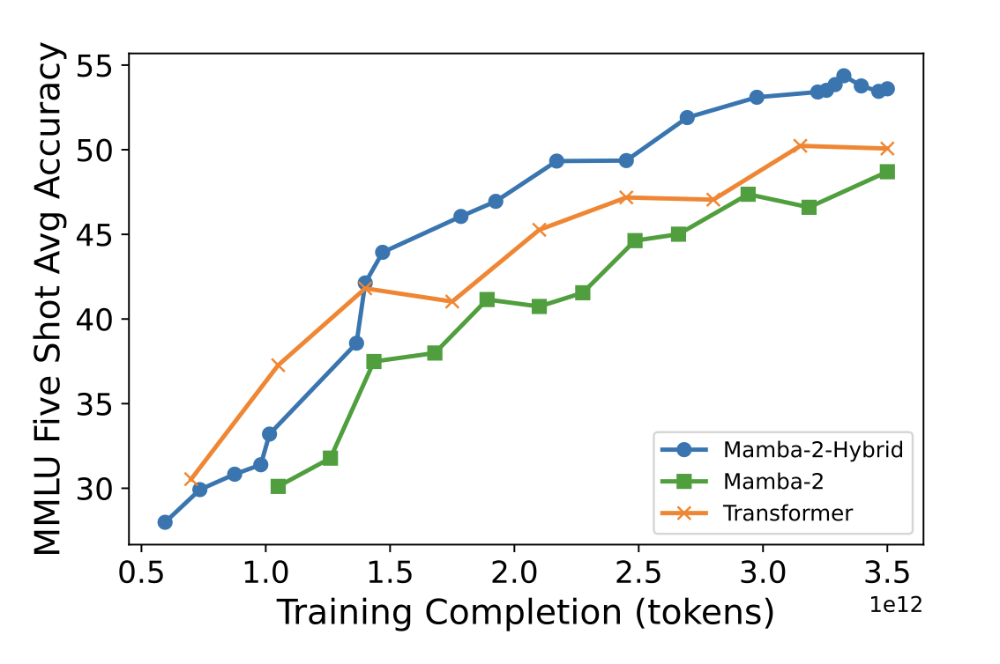

```head
<script src="https://d3js.org/d3.v6.min.js"></script>
<script src="https://cdnjs.cloudflare.com/ajax/libs/mathjs/9.4.4/math.min.js"></script>
```

## Intro

Welcome to the first part of the State Space Model series! Motivated by their recent popularity and my own interest in the topic, I decided to explore State Space Models (SSMs) in depth. In the series, we will cover everything you need to know about how SSMs work to understand their current uses, how they became competitive with the state-of-the-art, all the way up to the most recent advances.

I have organized into a cohesive story what I consider to be the most important resources I could find on modern SSMs and their model contemporaries. I'll focus on a particular subset of advances in the field, because covering all of them would be a bit hard. I also have tried to keep as constant a notation as possible, given that the ways of presenting the material have been changing through the years. If you have any questions or suggestions please let me know!

The series is divided into these parts:

- **Part 1: Motivation and introduction to SSMs** — You are here. We go through where SSMs are right now, how they entered the machine learning landscape, and what they are.
- **[Part 2: SSM neural networks and Structured State Spaces](../ssm_2_networks)** — We cover how SSMs were incorporated into neural networks, their shortcomings, and S4, an immediate successor and improvement.
- **[Part 3: State Space Selectivity (Mamba) and Duality (Mamba-2)](../ssm_3_mambas)** — We present Selective State Spaces and State Space Duality. Selectivity allows SSMs to focus on different parts of the input, like Attention. Speaking of, what's the relationship between SSMs and attention? In fact, they are surprisingly similar! What does this imply?

## State Space Models of today

The [Transformer (2017)](#attention) supremacy has been active for quite a few years now, and the ML discourse is mainly still centered around them. Many variations, tricks and hacks have been added on top of the original model, but the core mechanics stay the same: attention. Attention has allowed Transformers to stay as the state of the art in many tasks (mainly related to language). Of course, the Transformer is not the only architecture that is of use today, because in some domains it's not quite. Still, its dominance is clear!

But yes, other areas are also actively innovating. MLPs, CNNs, RNNs and other architectures are constantly "receiving" updates, but can't really catch up. Researchers are trying to come up with architectures that can support our views on how the future of AI will look like. One family of model architectures, based on State Space Models, has been stirring up some attention by the community.

SSMs have properties that make them appealing. For example, [Mamba (2024)](#mamba), an SSM-based architecture, scales linearly with the length of the sequence, has unbounded context and is able to model long-range dependencies.

{width=400 height=260}

So, let's learn about SSMs and judge for ourselves!

## State Space Models of yesterday

SSMs are not recent; they actually go back all they way to the mid 20-th century. In the 1960's, Wiener's and Kalman's work on control theory introduced the concept of SSM for modeling linear systems. And while SSMs started being used in many fields such as computational neuroscience, researchers were only able to incorporate them effectively into deep learning until very recently for theoretical reasons.

In 2020, partially because model architectures could not model long sequence data *efficiently* and in the search of alternatives, the [Long-Range Arena](#LRA) benchmark was presented. It focused on evaluating model quality under long context scenarios: data with Long Range Dependencies (LRD). In the paper, the authors found that for modeling that kind of data, it was hard to do better than vanilla Transformers.

The next year, [Albert Gu and others (2021)](#LSSL) showed that although vanilla SSM blocks could be used in conjuntion with other deep learning techniques, they struggled to efficiently model LRD data. But, in the following years, the theoretical framework was improved drastically with techniques and ideas that we will explore in the next posts. Before going into that, though, what *are* SSMs?

### The State Space Model

The idea of the SSM is the following: model each step in a sequence given its respective input and information about the previous state of the sequence.

In particular, given a instant $t$ and an input signal $x(t)$, an SSM maps it to an output $y(t)$ while keeping track of a state representation $h(t)$:

$$
\begin{align}
  h'(t) &= \mathbf{A} h(t) + \mathbf{B} x(t) \label{eq:ssm} \\
  y(t) &= \mathbf{C}h(t) + \mathbf{D}x(t) \nonumber
\end{align}
$$

Where $\mathbf{A}, \mathbf{B}, \mathbf{C}$ and $\mathbf{D}$ are weight matrices. Usually, the term $\mathbf{D}x(t)$ is not taken into account, because it can be equated to a skip connection and does not interact with the hidden state. We will assume this from now on. Also, we won't talk about dimensions in this post; they will be formalized in the second one.

{width=300 height=300 style="transform: translateX(-25px);"}

Equation \ref{eq:ssm} basically defines two things:

1. how the hidden state changes with respect to the current input and hidden state (the state representation) values.
2. how the output depends on the hidden state.

A few notes about the components:

- $\mathbf{A}$ defines how the previous hidden state influences the change of state.
- $\mathbf{B}$ defines how the input influences the change of state.
- $\mathbf{C}$ defines how the output depends on the hidden state.

Note how equation \ref{eq:ssm} works over the continuous space! Well, when working with signals, such a representation is common. In our case, and if we want SSMs to work with sequences like their colleagues (and as in the next visualization), this continuous representation is not completely accurate: sequences are discrete! Mathematically, discrete functions cannot be differentiated in the usual sense, so equation \ref{eq:ssm} is not valid. We need to **discretize** the SSM.

<div class="plot-container">
  <div class="plot-background-1-interactive" id="ssm_1_viz_4"></div>
  <script src="../../../src/viz/2024/ssm_1_4.js"></script>
</div>
<p class="plot-caption">Figure 3: interact with the "unfolded" view of an SSM! At every timestep, the input values are feed through the SSM, which processes it and outputs a value (a prediction of the next input, in this case). The state $h$ is updated at every step. Values of parameters and hidden state, as well as $\mathbf{D}$, are omitted.</p>

## Discretized State Space Models

The discretization of a signal can be interpreted as sampling. For example, given the continuous function $x(t)$, we sample the element $x_t$ with time interval $\Delta$ ($x_t = x(\Delta t)$). This gives us an input sequence $(x_1, x_2, ...)$.

{width=400 height=155}

In order to derive the discretized expression of the SSM, we observe how it behaves given a discrete input sequence. But, because the SSM cannot work with discrete data, we interpret the discrete sequence as continuous! There are actually quite a few ways to do this, but a common one is the zero-order hold.

{width=400 height=155}

We can study how the different parameters of the SSM behave under this reconstructed data. The "discretized" versions are annotated with an overhead line, and are dependent on the step size $\Delta$, which is a learnable parameter, and fixed discretization functions (like zero-order hold). So,

$$
\begin{align}
\bar{\mathbf{A}} &= f_A(\Delta, \mathbf{A}) \nonumber \\
\bar{\mathbf{B}} &= f_B(\Delta, \mathbf{A}, \mathbf{B}) \nonumber \\
\bar{\mathbf{C}} &= \mathbf{C} \nonumber
\end{align}
$$

Matrix $\mathbf{C}$ is not discretized because it only depends on $h(t)$, which in turn depends on the discretized matrices $\bar{\mathbf{A}}$ and $\bar{\mathbf{B}}$. Now, because the results are not trivial (a comprehensive explanation [here](#zerohold)), I won't go into details about why the discretized expression is like it is. I'm presenting these formulas only because you might happen to see them in other posts. In the case of $f$ being zero-order hold, the discretized parameters can be computed as:

$$
\begin{align}
  \bar{\mathbf{A}} &= e^{\Delta \mathbf{A}} \nonumber \\
  \bar{\mathbf{B}} &= (\Delta \mathbf{A})^{-1} (e^{\Delta\mathbf{A}}-\mathbf{I}) \cdot \Delta \mathbf{B} \nonumber
\end{align}
$$

The SSM can naturally work with sequence data! A large $\Delta$ will make the model take more into account the current input. The discretized version of the SSM is:

$$
\begin{align}
 h_t &= \bar{\mathbf{A}} h_{t-1} + \bar{\mathbf{B}} x_t \label{eq:ssm_dis} \\
 y_t &= \bar{\mathbf{C}} h_t \nonumber
\end{align}
$$

Now, the state equation refers to the update of the actual state, not its rate of change as in equation $\ref{eq:ssm}$. Note that the continuous representation of A, B, etc from equation \ref{eq:ssm} is still what is actually learned, and is later discretized. Recent works (2023) have proposed that this discretization step can be skipped and parametrize A and B directly. This is a bit easier to understand, but won't be actually used in the series.

To wrap up, for sequence data, an SSM will have a set of parameters $\mathbf{A}$, $\mathbf{B}$ and $\mathbf{C}$, their discrete versions $\bar{\mathbf{A}}$, $\bar{\mathbf{B}}$ and $\bar{\mathbf{C}} = \mathbf{C}$, and will transform an input sequence $(x_1, x_2, ...)$ into a sequence $(y_1, y_2, ...)$ by recursively applying formula $\ref{eq:ssm_dis}$.

{width=500 height=313}

## A mechanical example

Now that we know what they are and how they are formulated, let's see a SSM in action! We take an example from the amazing post [The Annotated S4](#annotatedS4).

Imagine we have a spring attached to a wall and supported by a horizontal surface. At the end of the spring there is a mass $m$ attached, like a weight. Over time ($t$) we pull on the mass with a force $u(t)$, making the spring bounce back and forth, dependent on its stiffness $k$ and the friction $b$. We constantly measure the position of the mass $y(t)$.

{width=300 height=210}

To model this system, remember that force is mass times acceleration. In a differential equation, and in the case of our system:

$$
\begin{equation}
u(t) - b\cdot y'(t) - k\cdot y(t) = m\cdot y''(t)
\label{eq:mechanics_diff}
\end{equation}
$$

That is, the friction $b$ impacts speed, and the stiffness $k$ impacts position, all subtracting from the force we apply. All that is equal to the mass of the weight times its acceleration.

We can express the system like an SSM: the rates of change of the system (speed and acceleration) are presented in equation $\ref{eq:ssm}$ as $h'(t)$, meaning that the hidden state $h(t)$ is actually just the position and speed. We also know that the input of the system is the force that its being applied, and the output is the position of the weight. So, we can derive the expression of the SSM parameters (omitted for brevity):

$$
\begin{align}
A &= \begin{bmatrix}
0 & 1 \\
-\frac{k}{m} & -\frac{b}{m}
\end{bmatrix} \nonumber \\

B &= \begin{bmatrix}
0 \\
\frac{1}{m}
\end{bmatrix} \nonumber \\

C &= \begin{bmatrix}
1 & 0
\end{bmatrix} \nonumber
\end{align}
$$

And there you have it. We can simulate it as an SSM.

<div class="plot-container">
  <div class="plot-background-1-interactive" id="ssm_1_viz_9"></div>
  <script src="../../../src/viz/2024/ssm_1_9.js"></script>
</div>
<p class="plot-caption">Figure 8: interact with the mechanical problem! Grab the weight, pull it, let go, and inspect the changing values. Under the hood, an SSM just like the one presented in the post is running (although we use <em>bilinear</em> discretization). Stiffness $k$ and step size $\Delta$ are shown scaled down 100x and up 1000x, respectively. Decrease $\Delta$ and the simulation will go slower.</p>

## Next up

We know their context, what they are and how they work. In the [next post](../ssm_2_networks), we are going to see how SSMs were incorporated into neural networks and scaled up.

## References

```references
[
  {"id": "attention", "author": "Vaswani et al", "year": "2017", "title": "Attention Is All You Need", "url": "https://arxiv.org/pdf/1706.03762"},
  {"id": "mambaBenchmark", "author": "Waleffe et al", "year": "2024", "title": "An Empirical Study of Mamba-based Language Models", "url": "https://arxiv.org/pdf/2406.07887"},
  {"id": "LSSL", "author": "Gu et al", "year": "2021", "title": "Combining Recurrent, Convolutional, and Continuous-time Models with Linear State-Space Layers", "url": "https://arxiv.org/pdf/2110.13985"},
  {"id": "LRA", "author": "Tay et al", "year": "2021", "title": "Long Range Arena: A Benchmark for Efficient Transformers", "url": "https://arxiv.org/abs/2011.04006"},
  {"id": "mamba", "author": "Albert Gu, Tri Dao", "year": "2024", "title": "Mamba: Linear-Time Sequence Modeling with Selective State Spaces", "url": "https://arxiv.org/pdf/2312.00752"},
  {"id": "annotatedS4", "author": "Sasha Rush, Sidd Karamcheti", "year": "2022", "title": "The Annotated S4", "url": "https://srush.github.io/annotated-s4/"},
  {"id": "zerohold", "author": "Xu Chen", "year": "2022", "title": "Discretization of State-Space System Models", "url": "https://faculty.washington.edu/chx/teaching/me547/1-8_zohSS_slides.pdf"}
]
```

```bibtex
@misc{chus2024SSM,
      author = {Jesus M. Antonanzas},
      title = {State Space Models: from 0 to Mamba-2},
      year = {2024},
      howpublished = {\url{chus.space/blog/2024/ssm_1_context}},
      note = {P1: intro to SSMs; P2: nets & S4; P3: Mamba & Mamba-2}
}
```