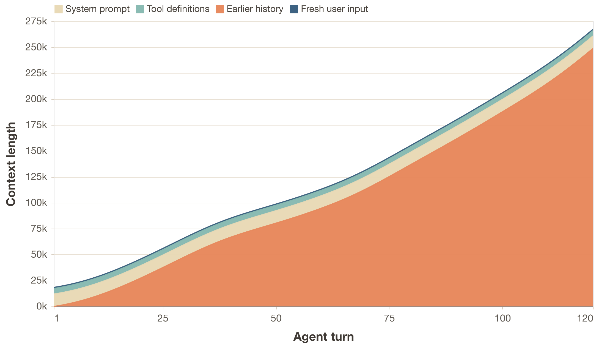
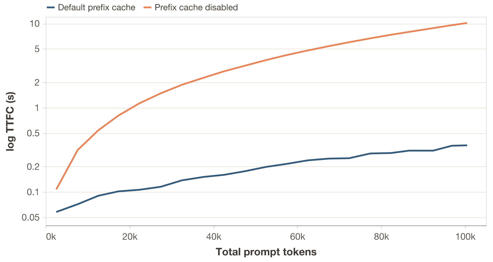
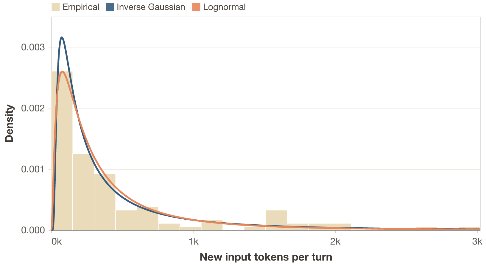
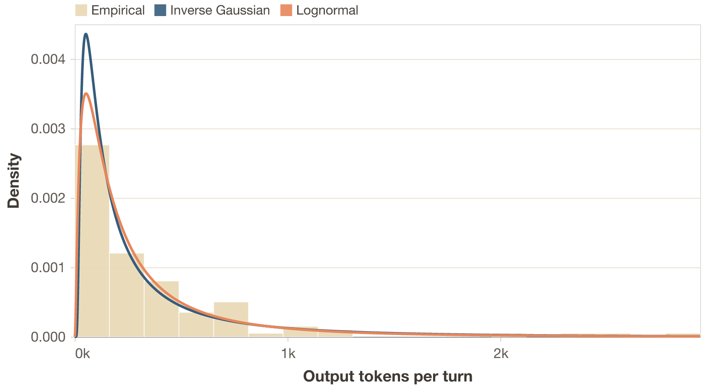
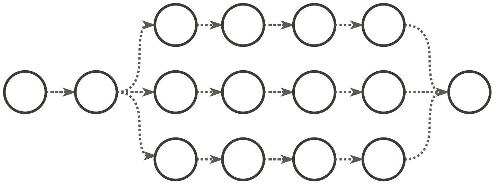
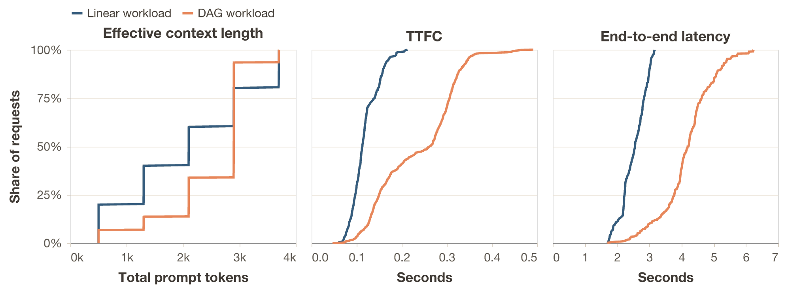
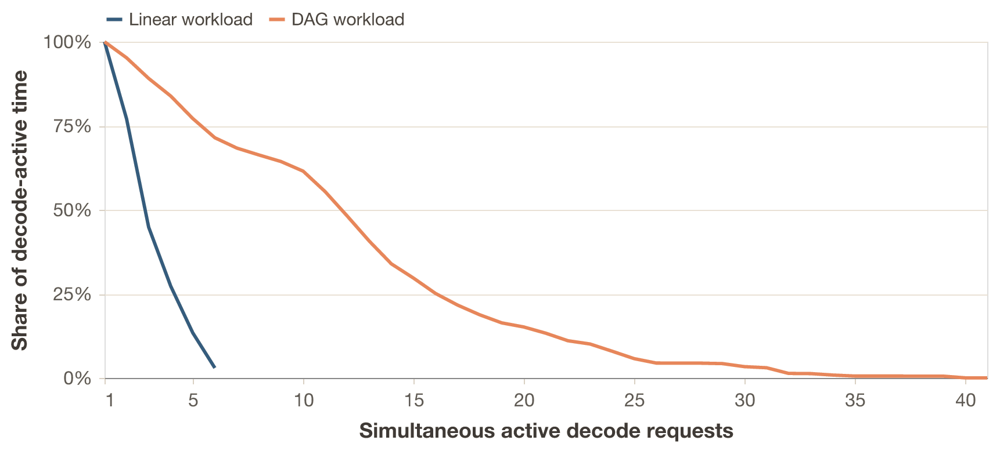
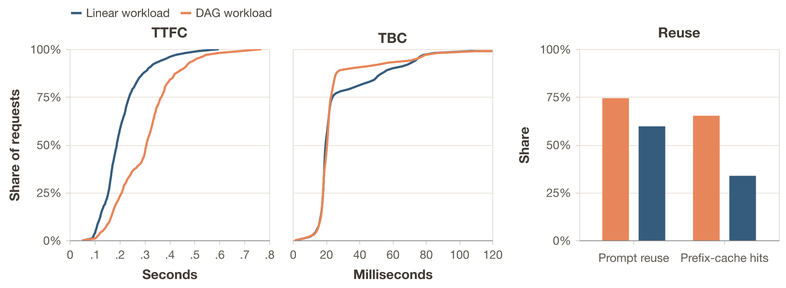
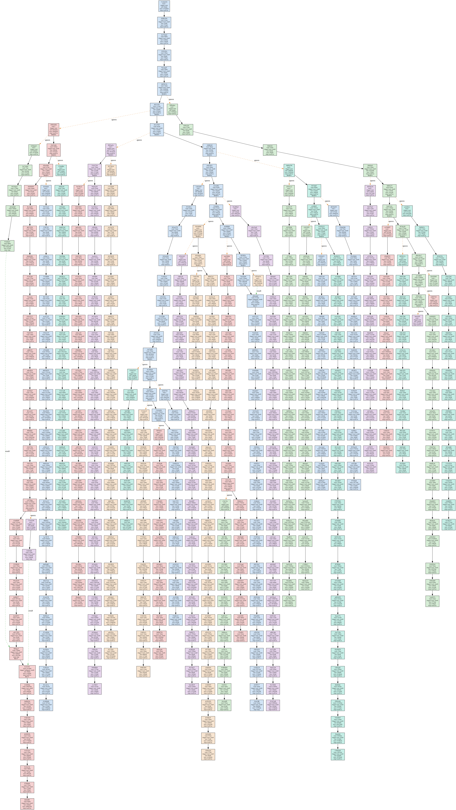
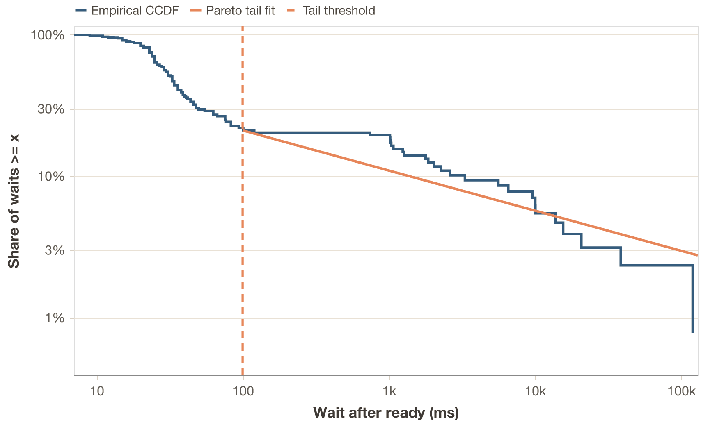

**TL;DR.** If your benchmark is a short chat loop, you may be measuring the
wrong workload regime. Agentic workloads turn one task into long-lived, branching,
bursty sessions with heavy prefix reuse, which reshapes cache behavior,
scheduler fairness, memory pressure, and even the fleet size you think you
need. This post shows how to model those workloads and benchmark them
reproducibly.

## Introduction {#sec:intro}

### The evaluation problem {#sec:intro-evaluation-problem}

Inference systems have a large configuration space. New optimizations ship
very fast, and each one interacts with others in ways that are hard to predict. To 
measure the quality of a particular configuration, you benchmark it. To compare inference systems
against each other, you benchmark them under the same conditions.

Several popular inference benchmarking projects do this: nightly benchmarks across systems,
reporting which one is fastest or most efficient. But what exactly do we mean when
declaring a system better or worse? [Artificial Analysis](#artificial-analysis) and 
[InferenceX](#inferencemax) are useful examples of this benchmarking style. An inference system might be 
excellent at bursty, short-context workloads, while subpar at long context ones. 
Another might shine with quantized models on specific hardware. The
definition of "good" depends entirely on the workload. For us to test an inference system
before deployment, we need to understand how it behaves under representative workloads.

However, inference systems are complex software, so reasoning about how a workload interacts with all of the relevant components or optimizations^[for example, what are the engine's policies for KV cache management or prefill and decode scheduling?] is not straightforward. So things are simplified. Common benchmark policies are to run independent requests or, at most, linear conversations: I send a message, the model responds, I append the response to the history, and send another. Maybe we can also have a few conversations running in parallel.

And even though simple workloads are useful for exactly that reason, and because they let us isolate variables, they might not test the full range of interactions between inference-system components. We could say that simple workloads are unit tests, while agentic workloads are integration tests.

### The workload gap {#sec:intro-workload-gap}

This means that there is a growing disconnect between what we benchmark and thus use as reference 
and what actually runs in production. Many prominent
LLM applications today are agentic systems rather than simple chatbots of the 2023 era. OpenClaw
and Claude Code run sessions with parallel tool calls, growing context and subagent
delegation ([OpenClaw subagents](#openclaw-subagents), [Claude Code subagents](#claude-code-subagents)). 
The workload they place on an inference system does not look like a short linear conversation or independent random requests.

IID requests and agentic sessions are different regimes for an inference system. 
Agentic workloads stress prefix caching across long sessions, memory 
management under bursty traffic, scheduling fairness when
sessions have wildly different context sizes. None of this shows up in simple
benchmarks. Evaluating on the wrong workload might lead to wrong conclusions, and wrong
conclusions might cost real money.

### Why not just run a real agent? {#sec:intro-real-agent}

So, when we want to fully evaluate the performance of an inference system, we don't just want to test it against the simple, traditional workloads, but also against agentic ones. Naively, one might think: just run OpenClaw against the inference system, give it some tasks, measure the timings. This does not work for rigorous evaluation, though:

- **Reproducibility.** LLM outputs are non-deterministic. The same task produces different tool-call sequences on different runs. The workload itself changes between experiments, making A/B comparisons impossible.
- **Control.** It is hard to isolate variables. It is also hard to test scenarios that deviate from the simplest case, like what happens when fan-out increases from 2 to 8, or when think time between requests grows. With a real agent, you cannot control that. With a benchmark framework you can just change a parameter.
- **Instrumentation.** A benchmark framework measures time to first token, time between tokens, cache hit rates, etc. at the right granularity, without instrumenting someone else's code.

What we want is to replicate the *shape* of agentic workloads: the structure,
the timing, and the distributions, without running an agent. That, in turn,
requires a benchmarking framework that generates or reads these workloads and allows you to measure what is needed.

### What this post does {#sec:intro-what-this-post-does}

To build such a benchmark, we first need a description of agentic workloads that
is general enough to apply across implementations, but still precise enough to predict
what an inference system sees. We do not really care whether "the agent writes
code" or "searches the web", but rather about the trace model: a graph of
inference requests, their input and output lengths, how much prefix each
request shares with the previous one, and how much time passes between
dependent requests.

I use OpenClaw as a reference, an open source agentic system with broad adoption (and
hype)^[I use it not only because it is open source; it is also
representative of systems with subagent spawning, parallel execution, and context management.].
The principles I extract apply to many agentic systems like Claude
Code, because they roughly share the same high-level execution patterns of tool use,
result appending, and subagent delegation (see [Claude Code subagents](#claude-code-subagents)).

Each principle corresponds to one part of this statistical description:
request-graph topology (length and branching), prefix reuse, input and output-length heterogeneity
and inter-request timing. For each, I connect the trace statistic to the inference system
in two ways. First-order consequences are direct changes in work: more
prefills, more decode tokens, larger fresh token tails, or more concurrent
sessions. Second-order consequences are what those first-order changes might do to
cache retention, scheduling, fairness, batching, and memory pressure. I aim to present:

1. How to roughly describe agentic traces statistically: as session graphs plus distributions over token counts, waits, shared prefixes, and branching.
2. How to replicate them in a benchmark: by measuring those distributions from real traces and generating matching synthetic sessions.
3. Why it matters: inference systems behave differently under agentic load, and evaluating on the wrong workload might not give you the full picture.

## Prerequisites {toc_subsections} {#sec:prerequisites}

Before we get into OpenClaw, let's set up our shared vocabulary and execution
model. If you work with inference systems, this will be familiar; if you don't,
this will be a quick overview.

### Inference basics {#sec:prerequisites-inference-basics}

An inference system handles user requests. When a request arrives, the system
computes and saves the keys and values of the input tokens: the prefill.
Then, it generates output tokens one at a time: the decode. In practice, the
system deals with many concurrent requests, carefully managing scheduling, CPU/GPU overlap, memory management, etc.
All optimizations on top of this, like advanced KV-cache policies, chunking, prefill-decode disaggregation, speculative decoding, and more, are generally strategies to make the prefill, decode, or both faster or more efficient under concurrency ([Orca](#orca), [DistServe](#distserve), [Sarathi-Serve](#sarathi-serve), [PagedAttention](#pagedattention)).

### Measuring inference performance {#sec:prerequisites-inference-performance}

When we evaluate an inference system, we care about how fast it does prefills
and decodes across a workload.^[In this post I focus on text-only requests because most agentic workloads, at the time of writing, are text-only. Requests can also be multimodal, in which case the relevant metrics could change. For example, in the case of an audio response, the Time to First Audio matters more than just TTFT.] The core metrics are:

- **TTFT**: time to first token. How long until the first output token arrives after submitting a request. Measures prefill speed.
- **TBT**: time between tokens. The interval between consecutive output tokens. Measures decode speed.
- **TPOT**: time per output token. Mean TBT across a request.
- **E2E latency**: total time from request submission to last output token.
- **Throughput (token or request)**: it may mean system level tokens/s or requests/s. Some also quote a per request token rate. In this post I name the specific quantity each time.

Everything else, like cost per token or energy per token, derives from these plus
hardware and pricing data. We can measure TTFT and TBT because modern inference
APIs stream tokens back, so we can observe each one as it arrives. Some systems
batch output tokens into chunks for efficiency, so we actually prefer TTFC (time to
first chunk) and TBC (time between chunks) instead for agnostic evaluation^[As of now, inference systems report streaming information differently, and there isn't a standard way of seeing the number of output tokens in output chunks. Counting the number of tokens in a chunk accurately is not always possible due to tokenization mismatches.]. Same idea but slightly
coarser (see, for example, [OpenAI streaming responses](#openai-streaming)).

### What is a session? {#sec:prerequisites-a-session}

Throughout this post, I use the term *session* rather than *conversation*. A
conversation is always linear: user, assistant, user, assistant. A session is
the generalization. That is, a graph of requests with dependencies.

In this framework, an independent request is a session with one node. A linear conversation is a
session where nodes form a chain, one after the other. An agentic session can be a chain too, but 
it can also be a DAG: when an agent spawns subagents, each runs its own chain of inference requests 
in parallel (!ref[fig:dag-case-study-2]).

### The agentic loop {#sec:prerequisites-agentic-loop}

Imagine we have an OpenClaw instance running. We are communicating with it via
our preferred interface, having a back-and-forth conversation with it, and we
ask it to perform a particular task. When the user message arrives, OpenClaw
starts a loop comprised of several stages. We can roughly categorize each step
as: Compose, Infer, Check, Execute and Append. First, it composes the new
message from history plus new context and sends it to the LLM for inference. It
checks if the LLM response was a final answer or if it decided to call tools
first. For example, it might need to read a file, run a command, search the
web. If so, the system executes the tool calls concurrently and appends all
results to history. This loop usually repeats until the model decides it has
completed the user's request.

!label[agentic-loop-pseudo]{A typical agentic loop.}

```python
def prompt(user_input, session):
  session.history.append({"role": "user", "content": user_input})

  while True:
    # One LLM inference request
    response = call_llm(
      system=session.system_prompt,
      tools=session.tool_definitions,
      messages=session.history,
    )
    session.history.append({"role": "assistant", "content": response.content})

    if response.stop_reason == "end_turn":
      return response

    # Make tool calls concurrently, then append results
    results = await gather(
      execute_tool(tc.name, tc.arguments) for tc in response.tool_calls
    )
    for tool_call, result in zip(response.tool_calls, results):
      session.history.append({
          "role": "tool_result",
          "tool_use_id": tool_call.id,
          "content": result.content,
      })
    # Loop back. Next iteration includes all tool results
```

So, each iteration of this loop is one inference request. An important
observation is that most tool calls (file reads, shell commands) do not involve
any LLM calls: they execute locally and return text. Some tools do call models
(image generation, LLM-backed web search), but those typically hit external
APIs, not the inference system serving the main agent.^[For example,
OpenClaw's web search can call Gemini, Perplexity, or other providers. These
are external requests that just look like timing gaps from our inference
system's perspective.] This means a single session without subagents produces
a linear chain of requests to the inference system under evaluation.

On top of this core loop, OpenClaw also has an outer loop that handles
infrastructure events like context overflow. This outer loop does not 
appreciably change the steady state of the workload.

These are the core mechanics of the agentic loop. In the next section, I treat
the properties induced by this loop as trace statistics.

## An agentic workload {toc_subsections} {#sec:agentic-workload}

Now that we know why agentic evaluations are important, and are familiar with
the basics of inference evaluation, what a session is, and how the agentic loop
works, we can start characterizing an agentic workload.

For the purposes of inference evaluation, an agentic workload is a set of
session graphs. Each graph represents inference requests as nodes and
dependencies as edges. Each node
carries quantities such as the number of input and output tokens, and
each edge carries a delay and a history inheritance relationship. A
benchmark does not need to replay exact tool semantics; it needs to reproduce
the distributions of these quantities. The principles below are the dominant
terms in that description. I extract them from real OpenClaw^[Technically, OpenClaw does not implement the agentic loop. 
According to the docs, it's a "... gateway for Pi agents". So we
are actually talking about Pi agents running on OpenClaw.] telemetry based
on real sessions.

### Request expansion {#sec:agentic-workload-1-request-expansion}

The agentic loop in !ref[agentic-loop-pseudo] already gives us the first principle: one user task expands into
a sequence of dependent inference requests. Most tool calls do not add requests
directly to the evaluated inference system, but they do trigger another LLM
call once their results are appended to history. A think+act+observe
cycle can therefore turn one human request into many inference requests.

Statistically, the quantity we care about is not "user turns" but the
distribution of inference requests per user task, or equivalently the depth of
these dependency chains. In the trace underlying !ref[experiment-1], 3 user interventions
expand into 130 inference requests, which is on the current low-medium end.
Very soon, I'd expect agentic loops to be able to generate thousands to 
10s of thousands of inference requests per user task.

The first-order consequence is that end-to-end latency compounds across many
sequential prefills and decodes, not one. The second-order consequence is that
the scheduler sees long lived dependent chains rather than iid requests, which
changes batching opportunities and how long session state remains live.

### Stateful prefix reuse

In !ref[agentic-loop-pseudo], we can see how every inference request includes the full
conversation history. The model needs to see everything that happened before to
produce a coherent next step: all user messages, assistant responses, tool
results and other content. Implementation-wise, this produces monotonic context
growth. Statistically, the more fundamental quantity is prefix overlap between
consecutive requests.

This means that each request in the chain is strictly larger than the previous
one. Turn N's input contains everything from turns 1 through N-1, plus
whatever new context was added. This means that every request is assembled as
follows (approximate numbers for Pi agents):

```
[system_prompt]      order of 10^4 tokens
[tool_definitions]   order of 10^3 to 10^4 tokens
[message_history]    grows with each turn
[new_input]          latest user message, tool results and other content
```

We can write an approximation of the input token count $n$ for turn N as:

$$n_N = S + D + \sum_{i=1}^{N} (U_i + A_i + R_i + X_i)$$

where $S$ is the system prompt, $D$ the tool definitions, $U_i$ the user input
at turn $i$, $A_i$ the assistant response, $R_i$ the tool results (zero if no
tools were called that turn), and $X_i$ other content such as injected or
synthetic history turns^[For example, subagent summaries that get injected
into the parent's context]. The key observation is not only that input grows,
but that request $N$ and request $N+1$ share almost all of their tokens as $N$ increases.

!label[context-growth]{Illustrative context growth over turns. For a single user intervention at turn 1, context grows until +250k. Model output, tool results and other events are accumulated in history, accounting for the majority of the context.}
{width=760 height=437}


#### Why this matters for the inference system

This is arguably the dominant property of agentic workloads. The prefix
overlap^[Defined as the ratio of the shared consecutive tokens, from the
start, to the total tokens in the input.] between consecutive requests is very
large, and it can reach 90-99% of the input. In other words, request $N$ and
request $N+1$ share almost all of their tokens. As the context horizon of LLMs
grows, this overlap will tend toward 100%.

On top of this, there is the **constant scaffold** formed by the system prompt and tool
definitions. This is an extremely high-value target for caching, as in most cases
it's repeated across all requests and sessions.

The first-order consequence is on prefill work. An inference system that
exploits this via prefix caching^[Prefix caching means reusing the KV-cache
computed for request $N$ when processing request $N+1$. Since the shared prefix
is identical, the system only needs to compute KV entries for the new tokens.
This turns prefill into an approximately constant-cost operation, but requires
complex cache management. Hybrid transformer + Mamba, sparse attention, or other lower-cache-footprint models
just decrease the slope of the memory requirement.] only needs to prefill the new tokens at each turn
(see [vLLM prefix caching](#vllm-prefix-caching)).
One that does not exploit it recomputes the entire growing history from
scratch.

The second-order consequence is on cache policy. Once the workload is dominated by prefix reuse, 
cache placement, eviction, and offloading strategies start to dominate TTFC differences between 
systems that otherwise use prefix caching and the same model. If
you evaluate an inference system on independent requests, where there is no
prefix to cache, you never observe this regime.

#### Case study 1: multi turn sessions {#experiment-1}

To make the workload regime concrete, we start with a simple first
case study: one real multi turn coding trace and a synthetic workload derived
from it. The goal here is to establish the basic prefix-reuse regime 
that the later case studies build on.

1. First, I ask OpenClaw 26.3.2 with GPT-5.1-Codex-Mini to implement a web app for interactive exploration of LLMs via interpretability methods. We cap the total inference time to ~15 minutes.^[Note that all numbers of trace characteristics in this post are probably going to underestimate what power users and more advanced agentic harnesses generate.]
2. Then, I measure statistical properties of the resulting trace: token counts, timings, prefix reuse, etc.
3. Next, I generate a synthetic workload from the trace that mimics the agentic pattern just described.
4. Finally, I compare that workload with and without prefix caching.

To run and measure all benchmarks, I use [Veeksha](https://github.com/project-vajra/veeksha)
v0.2.2, an open source benchmarking framework for LLM inference systems we (the Systems for AI Lab @ Georgia Tech) developed. It
supports sessions as graphs of requests with dependencies, configurable
timings, prefix caching simulations, replicating real-world workloads,
microbenchmarks, and more.

**Trace analysis**

When the agent is stopped, we obtain an OpenClaw trace that looks like this:

- 1 linear chain of inference requests
- 130 requests in total generated from 3 user interactions, an expansion factor of roughly 43x
- Median fresh input and output length of 490 and 214 tokens, respectively.^[Means 1570 and 612, inflated by a few long context requests.] Every pair of requests is roughly the model deciding to call a tool and then observing the result. Interestingly, we do not see the model deciding to call a batch of tools at once.
- A median waiting time of 32ms between requests (after the previous request finished; mean of 6s, biased by 2 slow interventions)
- A used context length of 117k tokens
- A total of 8.2 million token cache reads

**The synthetic workload**

We now have the first empirical parameters of the trace: chain depth,
per-request token counts, wait times, and prefix reuse. Let us now measure the
actual inference performance numbers with similar sessions. Here is the
approximate configuration for the multi turn workload. We set the
parameters to approximate the trace characteristics above based on the medians.
Take a moment to read it, as it will help you understand the workload and the
rest of the experiments.

!label[exp-1-workload-config]{The synthetic workload configuration for the multi turn sessions with prefix caching.}

```yaml
# Q: how are sessions generated?
session_generator:
  type: synthetic # synthetically, with a linear (chain) shape
  session_graph:
    type: linear
    num_request_generator: # each session has between 100 and 150 turns
      type: uniform
      min: 110
      max: 150
    request_wait_generator:
      type: poisson
      arrival_rate: 31.25 # turns wait a mean of 32ms before being dispatched
  channels: # each turn introduces between 400 and 600 new tokens from the user...
    - type: text
      body_length_generator:
        type: uniform
        min: 400
        max: 600
  output_spec: # ... and 150 to 250 new tokens from the assistant
    text:
      output_length_generator:
        type: uniform
        min: 150
        max: 250

# Q: how are sessions dispatched to the inference system?
traffic_scheduler:
  type: concurrent # with a concurrency-based scheduler...
  target_concurrent_sessions: 1 # ...that allows one session at a time

# We dispatch 5 sessions in total
runtime:
  max_sessions: 5

seed: 77
```

I run the above workload independently against two Qwen3.5-35B-A3B
replicas (thinking disabled), each one running on vLLM 0.17.1 and an H100 GPU. Replica A uses the default
prefix cache configuration, while replica B has it disabled.

**What is happening?**

- With the default prefix cache, TTFC stays in the sub-second regime even as the session approaches 100k prompt tokens.
- With prefix caching disabled, the full prompt has to be recomputed on every turn, so TTFC rises into the multi-second regime as context grows.

!label[exp-1-ttfc]{TTFC versus total prompt tokens for the same synthetic requests (log scale on the y-axis). With the default prefix cache, median TTFC grows from roughly 60ms to 0.33s across the session. With prefix caching disabled, median TTFC rises from roughly 0.1s to about 10s by the time the prompt reaches 100k tokens.}
{width=640 height=330}

**Takeaway**

This first case study mainly establishes the regime. Agentic workloads are
long lived, stateful traces with very high prefix reuse, so cache handling
quickly becomes a dominant factor in latency. Once that basic effect is in
place, the more interesting questions are the ones taken up in the next
sections: how token heterogeneity, bursty timing, and branching change the
behavior of systems that already exploit prefix reuse.

### Token-count heterogeneity {#sec:token-heavy-tail}

Prefix reuse does not mean the amount of new work per step is constant. At any
point in an agentic loop, the model might append a small memory lookup, a medium
shell output, a huge file read, or a large batch of tool results. There are
other context injection events too, like subagents sending summaries and
artifacts to the parent agent. Similarly, the distribution of output tokens in
an agentic workload is dictated by a variety of events. Many inference requests
return small messages, where the model selects tools or acknowledges results.
They usually stem from intermediate control events in the loop of
!ref[agentic-loop-pseudo]. Others, like turn ends, where models modify
artifacts or respond to the user, or context overflows, where the model needs to
compact the full history, generate larger answers.

Statistically, the quantities that matter are the incremental input size between
consecutive requests, that is, the number of fresh, non-cached tokens added on
top of the shared prefix, and the number of output tokens generated per request.

In real agentic traces both distributions are broad and usually heavy tailed (!ref[principle-3-heavy-tail-prefill],
!ref[principle-4-heavy-tail-decode]).
Most steps add a modest amount of tokens and generate short outputs, but a small
number create very large bursts.

!label[principle-3-heavy-tail-prefill]{Empirical vs fitted distributions of new input tokens for the trace in !ref[experiment-1]. Cropped to 95th percentile (max value is around 20000 tokens). Most steps add just a few new input tokens, but a small number add very large bursts. I tested lognormal, Weibull, gamma, exponential, Pareto, normal and inverse Gaussian distributions, and found that the latter fits best (MLE + goodness of fit with loglikelihood).}
{width=589 height=315}

Performing the same fitting experiment on output tokens also yields the inverse Gaussian as
the best fit for our empirical data in the multi turn workload of
!ref[experiment-1].

!label[principle-4-heavy-tail-decode]{Empirical vs fitted distributions of generated output tokens for the trace in !ref[experiment-1]. Cropped to 95th percentile (max value is around 14000 tokens). Same tested distributions as for the input tokens, and same best fit.}
{width=589 height=300}

The first-order consequence is that both prefill and decode work are
heterogeneous across the trace rather than roughly constant per turn. Two
requests with similar total context length can have very different prefill costs
depending on how large the fresh tail is, and some generations are much longer
than others. The second-order consequences are different for the two phases.
Large fresh token bursts create prefill interference: they occupy prefill
capacity for longer, which can perturb batching and worsen tail latency for
other sessions sharing the system. Long generations remain active for longer,
which extends the lifetime of the KV and changes batch characteristics.
Depending on the inference engine, this can affect metrics such as throughput, completion
latency, TBT, or fairness under mixed workloads.

For benchmarking, the direct consequence is that we should not model either side
with smooth average increments per turn, or sample from uniform distributions.
For example, in Veeksha's spec (!ref[exp-1-workload-config]), this means we change
`text.body_length_generator` and `text.output_length_generator` from `uniform` to:

```yaml
body_length_generator:
  type: inverse_gaussian
  mean: m
  shape: s # controls dispersion; lower -> heavier tailed
```

Here:

- `m` is ~815 for input tokens and ~615 for output tokens
- `s` is ~200 for input tokens and ~145 for output tokens

**Prefix invalidation**

When the context length reaches its limit in modern agentic systems, a compaction event is created. The event creates a request asking the model to summarise, and then a new session is created with the summary as fresh context. This effectively invalidates the prefix of the original session.

We can model this event using the previous notes on prefill and decode heterogeneity, because it creates moderately sized decodes (for summarisation) and prefills (for the new session with fresh summary), which fit within that heavy tail description.

### Bursty timing

Agentic systems are being given more and more ways to interact with the world: file reads and writes, program execution, API calls to other systems, computer use, and soon more autonomous real-world interaction and task navigation. We can consider these as tool calls in our agentic loop of !ref[agentic-loop-pseudo]. The idle time between subsequent requests in a session is dictated mainly by three factors:

1. If it is a user turn, how long the user takes to respond
2. If it is a tool turn, the nature of the tool. A test suite might take minutes, a file read might take tens of ms.
3. Dispatch inefficiencies of the agentic system.

In the context of session graphs, I define the property `wait_after_ready` of a node (request) as the time
between completion of the last parent request and the dispatch time of the node. If we look at its
distribution in our sample trace, we see that almost 80% of the waits are less than 100ms, while the upper
tail is heavy, with 6% being larger than 10 seconds. This effect is similar to that of the input and output token distributions.

Again, this heavy tail effect has implications beyond workload shape. During idle periods of a session, its KV state stays unused. This in turn increases the chance that, due to memory pressure and cache policies, at least part of the cache will no longer be resident by the time the next request of the session is dispatched. The session will then have to pay a recomputation cost. This is not necessarily bad, as it might be the correct global decision; the point is that it creates a cache-allocation tradeoff, thus affecting other local properties.

**Fidelity on synthetic workloads**

While the empirical distribution of wait times roughly matches that of the tokens, a best fit analysis tells us that it is not well described by a single, smooth distribution; a spike+tail description fits best (!ref[fig:wait-after-ready-tail-ccdf] in annex). I measured another trace, arguably more complete and representative, and got similar results. So, does this mean that a benchmarking framework should support sampling wait times according to complex spike+tail generators? I argue that with synthetic workloads, we care more about preserving clarity and the broad operational regime instead. An inverse Gaussian or lognormal distribution would do it.

If we care about absolute fidelity, a better option is to **replay traces**, preserving every detail of the original workload instead of approximating it. This option is especially useful for those who already have a lot of production traffic.^[Veeksha can do this for a variety of trace types, like agentic ones directly from Claude Code or OpenClaw, while preserving the DAG, token, and timing distributions of the workload.]

### Session branching {#sec:session-branching}

Until now, we have been describing characteristics of linear sessions. A big component of agentic workloads, though, is how agents can spawn subagents. As agentic capabilities improve, we will likely see deeper and deeper hierarchical delegation of work, with each subagent focused on some particular task.

In practice, there are many ways to implement subagents and their reporting strategies.^[Should agents communicate across hierarchies? Only to their parents? Peers?] In the case of the OpenClaw harness, the subagent flow is:

1. Agent decides to spawn a subagent. It does so by calling the `sessions_spawn` tool, which asynchronously spawns a subagent.
2. Subagent starts with its own system prompt plus the task description from the parent as context. It does not inherit the full context.
3. When finished, the subagent announces the results back to the parent. The parent receives a message with the subagent's output.
4. Nesting depth (sub-subagents and more) and number of allowed spawns per agent are configurable, as well as max concurrency (see [OpenClaw session tools](#openclaw-session-tools) and [OpenClaw subagents](#openclaw-subagents)).

In the context of the DAG that is an agentic session, this means that any node can have multiple children or parents. It isn't a linear chain anymore. Fan-out and fan-in degrees can be bigger than 1, which creates dependencies between requests in a way that we didn't have before. It also introduces context inheritance dynamics between nodes (not all nodes inherit the full history).

!label[fig:dag-case-study-2]{A simplified DAG session. One request has a fan-out degree of 3 (subsession spawn), and one a fan-in degree of 3 (subsessions reporting back). Shape used in !ref[sec:case-study-2] and !ref[sec:case-study-3].}
{width=523 height=200}

To illustrate this, I ask OpenClaw to produce a high quality knowledge graph and analysis of all major AI frameworks —a naturally modular task, as each subagent can be dedicated to researching some part of a particular framework. After about five minutes, OpenAI rate limits are reached, at which point the session is:

- 575 requests total
- 35 sessions (spawns)
- ~3.2M total input tokens
- ~150k total output tokens
- 44 requests deep on the longest path
- 25 requests wide at the maximum width
- A max fan-in and fan-out degree of 2.

Take a look at the resulting session graph in the annex (!ref[openclaw-dag-branching]).

When building an agentic benchmark, we need to consider details such as branching factor, depth and length of child sessions, and history inheritance ratios. Higher branching factors usually mean much higher request concurrency, with both obvious and subtler implications. They directly affect the total pressure of the workload on the inference system's memory, compute, and scheduling state.

#### Case study 2 {#sec:case-study-2}

The observed OpenClaw trace is rich in structure, with nested spawning but limited measured fan out before rate limiting.
For controlled experiments I replace it with a simplified 3 way DAG (!ref[fig:dag-case-study-2]) that isolates the effect of branching.

I now compare two workloads with the same total fresh tokens in the traces, but that differ in shape. 
Workload A ("linear workload") is a sequence of short linear sessions, while workload 
B ("DAG workload") is a sequence of the above-mentioned DAG sessions (!ref[fig:dag-case-study-2]). 
Over a full pass of the traces, they both have the same total number of new input and output tokens, so from the 
application's perspective they do the same amount of work. In the timed replay, however, I keep the session 
arrival rate fixed and allow the traces to wrap. This does not imply identical inference work over 
time: the DAG workload may, for example, decode at longer effective context lengths, induce different cache 
patterns, and wrap around faster. The point is to show that, even when traces 
look similar under the same user token budget, session topology and replay setup
can change reported performance, even at fixed session dispatch rates, if not taken into account properly. 

I run both workloads independently against the same system from a fresh start, at a shared session arrival rate
of 0.18 sessions/s. The linear workload uses 30 sessions of 5 requests each, while the DAG workload uses 10
sessions of 15 requests each (!ref[fig:dag-case-study-2]) with a 3-way fan-out and fan-in.^[Workload spec, results and Veeksha config in annex (!ref[sec:annex-workload-shape]).] `wait_after_ready` is always 0.
I create the traces synthetically and replay them for 300 seconds with Veeksha's `timed_synthetic_session` trace
session generator (in annex). Because the run uses wrap mode, the 10-session DAG trace wraps around faster than 
the 30-session linear trace at the same session arrival rate. The model and system are the same as in !ref[experiment-1].

!label[case-study-2-context-latency]{Same total fresh tokens in the traces, different effective work under timed replay. Left: ECDF of total prompt tokens. Middle: TTFC ECDF. Right: end-to-end latency ECDF. Even though both traces have the same total new input and output tokens per full pass, the DAG workload shifts mass into the longer context regime, moving the latency curves.}
{width=760 height=282}

With the same total fresh tokens in the traces, the DAG workload has 116.7% higher TTFC p99 and 77.2% higher E2E
p95 than the linear workload. Its mean prompt length is also 20.2%
longer. See !ref[sec:annex-workload-shape] for the full
comparison.

Figure !ref[case-study-2-context-latency] also shows why looking
only at prompt length p95 is misleading here: the p95 total prompt length is
effectively unchanged, but the median rises from 2100 to 2899 tokens, so
much more of workload B spends time in the long context regime. B also induces
burstier concurrency: while session arrival is 0.18 sessions per second, 
the scheduler sees far more simultaneous active decodes because DAG sessions contain 
more requests with some degree of dispatch parallelism. And even though B has a 39% higher prefix 
cache hit rate than A, it is not enough to compensate for the last two characteristics; this
increases the observed TTFC.

!label[case-study-2-decode-overlap]{Duration-weighted decode overlap. For each x axis value k, the y axis shows the share of total decode time spent with at least k simultaneous decode requests. The linear run never exceeds 6 simultaneous active decodes. The DAG run reaches 41, and spends more than 60% of decode-active time at 10+ simultaneous decode requests.}
{width=700 height=315}

Session topology and trace wrapping can strongly influence benchmarking results if they are not studied properly beforehand.
Inference systems, however, are not usually provisioned for a fixed total token budget.

#### Case study 3 {#sec:case-study-3}

Case study 2 briefly shows that when evaluating capacity, one needs to be vigilant about proper workload alignment.
Case study 3 asks: after tuning each workload to its own SLO frontier, how much healthy work can each shape sustain on the same hardware?
I tune two inference deployments on the previous DAG and linear workloads, using the same system and model, provisioning each one
based on maximizing healthy normalized request rate $\rho$. A healthy run is defined by a P95 TTFC $\leq$ 0.75s, a 
P95 TBC $\leq$ 75ms and an error rate $\lt$ 2%.
$\rho_l$ refers to the normalized request rate given the linear workload as reference, and $\rho_d$ for the DAG workload. 
$\rho_l^*$ and $\rho_d^*$ refer to the maximal value found in the respective value search.

In both workloads, each request always has 500 fresh input tokens and asks for 300 output tokens,
so each deployment sees a fresh input rate of 500$\rho$ tokens/s and a requested output rate of 300$\rho$ tokens/s for
all values $\rho$ in the search grid.
Session dispatch rates are thus:

- $\frac{\rho_l}{5}$ sessions/s for the linear workload
- $\frac{\rho_d}{15}$ sessions/s for the DAG workload

I compare both deployments and show how it is possible to underprovision or overprovision when reference workloads don't match production traffic.

**Results**

If the real traffic is DAG-shaped but the fleet was sized on a linear reference, the linear-tuned fleet is roughly 21% larger than needed: 17.5% slack capacity. The experiments yield $\rho_l^*$ of 5.50 and $\rho_d^*$ of 6.67: with the exact same configuration and hardware, DAG sustains about 1.21x more useful work under the same SLO regime. Both workloads hit TBC p95 as the binding SLO constraint at almost identical absolute values (74.9 ms vs 74.6 ms), so the frontier is decode-bound in both cases.

The reason the DAG workload can absorb more load is prefix reuse. At its own frontier, DAG achieves a prefix-cache hit rate of 0.652 versus 0.338 for linear at its frontier, and a prompt reuse ratio of 0.744 versus 0.597. DAG's TTFC is consistently higher than linear's, but the high prefix reuse means most of that length is cached, freeing decode capacity. The binding constraint is TBC, not TTFC, so the prefill savings translate into room for a higher request rate.

To confirm this, I replay the DAG workload at the linear frontier rate $\rho_l^*=5.50$. The DAG workload is comfortable: all SLOs are met with headroom. TBC and E2E p95 are lower at 57.6 ms (vs 74.9ms for linear) and 8.40s (vs 11.61s for linear), respectively. TPOT throughput rises from 35.6 to 47.0 tok/s. The system is underloaded.

!label[case-study-3-frontier-metric-facets]{Frontier behavior at the optimal normalized request rates $\rho_l^*=5.50$ and $\rho_d^*=6.67$. Linear TTFC (left) is lower, consistent with its shorter context lengths. DAG has a better mid tail distribution and reaches a similar p95 at a higher load, consistent with higher cache reuse (right).}
{width=760 height=290}

!ref[deployment-frontier-case-3], !ref[frontier-metrics-case-3], and !ref[capacity-implication-case-3] in the annex collect the full numbers.

## Conclusion

### Simple and agentic workloads (you need both)

Simple workloads are useful for measuring raw prefill or
decode performance and for isolating confounding variables. Agentic workloads
reveal deeper effects in inference systems, like cache
retention under bursty traffic, scheduling fairness under mixed concurrency,
memory pressure from long-lived sessions, and the combined effects of request
expansion, branching and prefix invalidation.

### Putting it all together

A single agentic session is usually a DAG of parallel inference chains 
with partial history inheritance. One user task
expands into many inference requests, consecutive requests share most of their prefix, fresh
input and output sizes vary widely, waits are bursty, and occasional compaction
events invalidate the prefix.

The key properties are:

- Request expansion: the think-act-observe loop turns one user task into a long chain of dependent requests.
- Stateful prefix reuse: full-history appends make consecutive requests share most of their prefix, though compaction or partial-history handoffs can reset or reduce that reuse.
- Token-count heterogeneity: tool results, summaries and final answers create broad fresh-input and output distributions, including compaction events that generate summary decodes and prefill restarts.
- Bursty timing: tool latency, user think time and dispatch overhead create broad `wait_after_ready` gaps.
- Session branching: `sessions_spawn` turns one chain into a DAG with fan-out, width and partial history inheritance, while repeated agent and subagent scaffolds create reuse opportunities across sessions.

In conclusion:

1. Agentic traces are structured as session graphs plus distributions over token counts, waits, prefix reuse, invalidations and branching.
2. We can benchmark them without running a real agent by measuring those distributions and generating synthetic sessions from them. Replaying traces is also useful.
3. This matters because inference systems behave differently under agentic load, so the wrong workload can give the wrong conclusion.

### Where to go from here

If you want to try these ideas on your own inference system, the
Veeksha [repository](https://github.com/project-vajra/veeksha) and
[documentation](https://project-vajra.github.io/veeksha) are a good
starting point. Thank you for reading.

*Experiment results, OpenClaw telemetry and more available in the
[GitHub repo](https://github.com/chus-chus/blogpost_agentic_workloads).*

### Acknowledgements

I’d like to thank Souradeep Bera and Elton Pinto for their helpful feedback on this post, as well as the entire Vajra Project team for their support and contributions to Veeksha’s development.

## References

```references
[
  {"id": "inferencemax", "author": "InferenceX", "year": "2023", "title": "InferenceX (formerly InferenceMAX)", "url": "https://inferencex.semianalysis.com"},
  {"id": "artificial-analysis", "author": "Artificial Analysis", "year": "2026", "title": "Artificial Analysis Evaluations", "url": "https://artificialanalysis.ai/evaluations"},
  {"id": "claude-code-subagents", "author": "Anthropic", "year": "2026", "title": "Claude Code Docs: Create custom subagents", "url": "https://docs.anthropic.com/en/docs/claude-code/subagents"},
  {"id": "openclaw-session-tools", "author": "OpenClaw", "year": "2026", "title": "OpenClaw Docs: Session Tools", "url": "https://docs.openclaw.ai/concepts/session-tool"},
  {"id": "openclaw-subagents", "author": "OpenClaw", "year": "2026", "title": "OpenClaw Docs: Subagents", "url": "https://docs.openclaw.ai/tools/subagents"},
  {"id": "pagedattention", "author": "Kwon et al", "year": "2023", "title": "Efficient Memory Management for Large Language Model Serving with PagedAttention", "url": "https://arxiv.org/abs/2309.06180"},
  {"id": "orca", "author": "Yu et al", "year": "2022", "title": "Orca: A Distributed Serving System for Transformer-Based Generative Models", "url": "https://www.usenix.org/system/files/osdi22-yu.pdf"},
  {"id": "distserve", "author": "Zhong et al", "year": "2024", "title": "DistServe: Disaggregating Prefill and Decoding for Goodput-optimized Large Language Model Serving", "url": "https://openreview.net/forum?id=sNifYctwnP"},
  {"id": "sarathi-serve", "author": "Agrawal et al", "year": "2024", "title": "Taming Throughput-Latency Tradeoff in LLM Inference with Sarathi-Serve", "url": "https://arxiv.org/abs/2403.02310"},
  {"id": "openai-streaming", "author": "OpenAI", "year": "2026", "title": "Streaming API responses", "url": "https://platform.openai.com/docs/guides/streaming-responses"},
  {"id": "vllm-prefix-caching", "author": "vLLM Project", "year": "2026", "title": "Automatic Prefix Caching", "url": "https://docs.vllm.ai/en/stable/design/prefix_caching.html"}
]
```

## Annex {#sec:annex}

!label[openclaw-dag-branching]{Real session structure extracted from the trace in the section !ref[sec:session-branching]. Open in a new tab for high-resolution exploration. Only 2 subagents return results because I hit rate limits quickly.}
{width=650 height=1150}

!label[fig:wait-after-ready-tail-ccdf]{Empirical CDF of `wait_after_ready` for the OpenClaw trace in !ref[experiment-1], log-log axes. The dashed line marks the 100 ms threshold used for the Pareto tail fit. We see the initial spike and the slower heavy tail.}
{width=680 height=408}

### Annex: case study 2 {#sec:annex-workload-shape}

!label[workload-spec-case-2]{Workload specification of case study 2 runs.}
| Property | Linear workload | DAG workload |
| --- | --- | --- |
| Shared session arrival rate | `0.18` sessions/s | `0.18` sessions/s |
| Sessions | `30` | `10` |
| Requests per session | `5` | `15` |
| Total requests | `150` | `150` |
| Fresh input tokens per request | `500` | `500` |
| Output tokens per request | `300` | `300` |
| Total new input tokens | `75000` | `75000` |
| Total output tokens | `45000` | `45000` |

!label[veeksha-config-case-2]{Sample Veeksha configuration for case study 2 DAG runs.}
```yaml
session_generator:
  type: trace
  trace_file: traces/workload_shape/workload_b_dag.jsonl
  wrap_mode: true
  flavor:
    type: timed_synthetic_session
    page_size: 16

seed: 42
output_dir: benchmark_output/workload_shape_case_study/qwen/dag

server: !include shared/server_h100_qwen3_5_35b_a3b.yml
traffic_scheduler: !include shared/rate_traffic.yml
client: !include shared/client_qwen3_5_nonthinking.yml
runtime: !include shared/runtime_qwen.yml
evaluators: !include shared/evaluators.yml
trace_recorder: !include shared/trace_recorder.yml
```

!label[observed-comparison-case-2]{Observed comparison for case study 2.}
| Metric | Linear | DAG | DAG vs. linear |
| --- | --- | --- | --- |
| Mean total prompt tokens per request | `2094.3` | `2517.5` | `20.2%` |
| TTFC p99 | `0.205s` | `0.444s` | `116.7%` |
| E2E p95 | `3.054s` | `5.410s` | `77.2%` |
| TBC p99 | `11.1 ms` | `52.4 ms` | `372.1%` |
| vLLM prefix-cache hit rate | `0.495` | `0.690` | `39.4%` |

### Annex: case study 3 {#sec:annex-deployment-claim}

!label[deployment-frontier-case-3]{Case study 3 frontier and first-failure points under the shared p95-based SLO regime.}
| Quantity | Linear workload | DAG workload |
| --- | --- | --- |
| Max healthy normalized request rate $\rho^*$ | `5.50` | `6.67` |
| First failing normalized request rate | `5.51` | `6.68` |
| First limiting SLOs | `TBC p95 > 75ms` | `TBC p95 > 75ms` |

!label[frontier-metrics-case-3]{Observed frontier metrics and same-budget replay metrics for case study 3.}
| Metric | Linear at $\rho_l^*=5.50$ | DAG replay at $\rho_l^*=5.50$ | DAG at $\rho_d^*=6.67$ |
| --- | --- | --- | --- |
| TTFC p95 | `0.386s` | `0.426s` | `0.508s` |
| E2E p95 | `11.61s` | `8.40s` | `9.69s` |
| TBC p95 | `74.9 ms` | `57.6 ms` | `74.6 ms` |
| TPOT throughput | `35.6` tok/s | `47.0` tok/s | `39.8` tok/s |
| Prefix-cache hit rate | `0.338` | `0.686` | `0.652` |
| Prompt reuse ratio | `0.597` | `0.743` | `0.744` |

!label[capacity-implication-case-3]{Derived deployment implications for case study 3.}
| Comparative quantity | Value |
| --- | --- |
| DAG replay at $\rho_l^*$ meets all SLOs | `yes` |
| DAG / linear useful-work ratio at the frontier | `1.21x` |
| Fleet fraction needed if real traffic is DAG-shaped | `0.825x` |
| Slack capacity in the linear-tuned fleet | `17.5%` |
| Linear-tuned fleet size relative to DAG need | `1.21x` |
