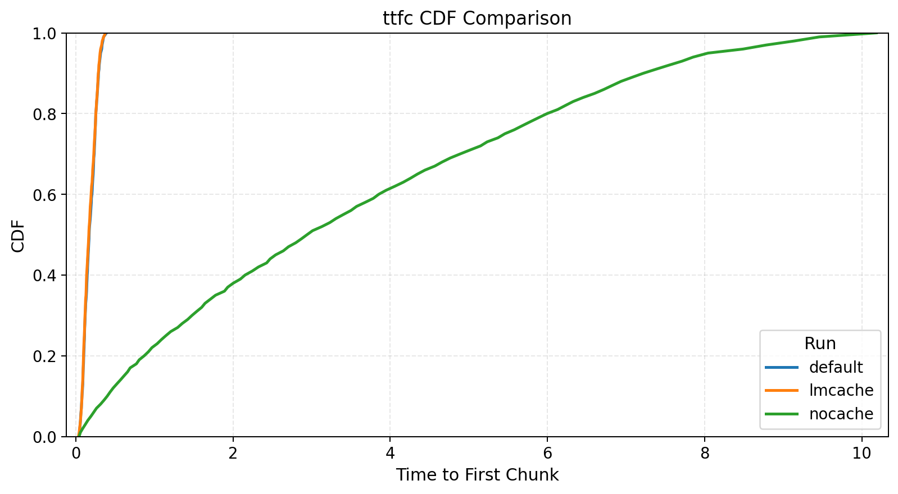
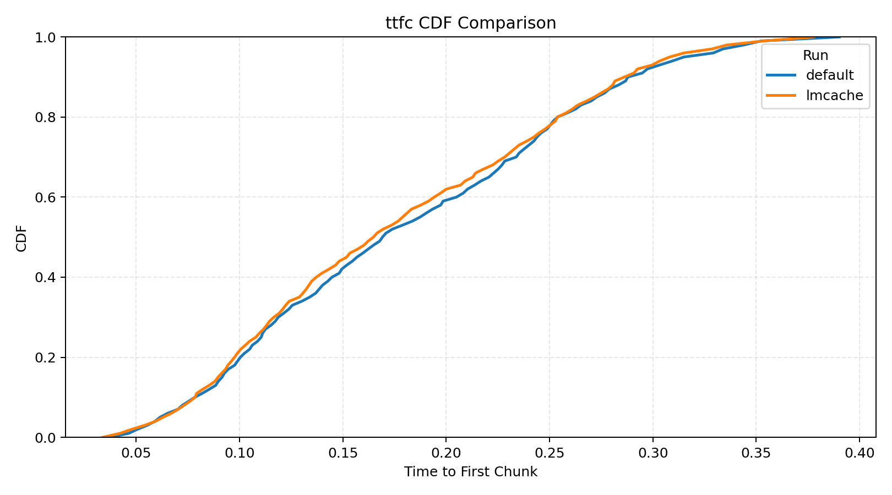
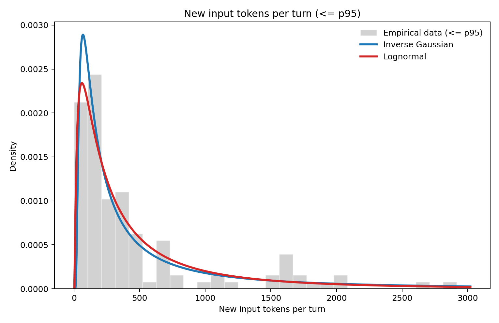

## Introduction {#sec:intro}

### The evaluation problem {#sec:intro-evaluation-problem}

Inference systems have a large configuration space. New optimizations ship
very fast, and each one interacts with others in ways that are hard to predict. To know
whether a configuration is good or not, you test it. To compare inference systems
against each other, you test them under the same conditions.

Common popular inference benchmarking projects do this: nightly benchmarks across systems,
telling you which is fastest or most efficient, giving you the most bang for your buck. But when we say one system
is "better" or "worse", in what context do we mean? An inference system might be 
excellent at bursty, short-context workloads, while subpar at long-context ones. 
Another might shine with quantized models on specific hardware. The
definition of "good" depends entirely on the workload. For us to test an inference system
before deployment, we need to understand how it behaves under representative workloads.

?figure: an informative workload is everything

However, inference systems are complex scheduling software, which makes reasoning about how a workload interacts with all of the relevant components or optimizations^[for example, what are the engine's policies for KV cache management or prefill and decode scheduling?] really not straightforward. So we usually simplify. Common benchmark policies are to run independent requests or, at most, linear conversations: I send a message, the model responds, I append the response to the history, send another. Maybe we can also have a few conversations running in parallel. 

And even though simple workloads are useful for that same reason and because they let us isolate variables, they might not be testing the whole range of interactions between components of the inference system. The reader might even let me make this analogy: simple workloads are unit tests, while agentic workloads are integration tests.

### The workload gap {#sec:intro-workload-gap}

This means that there is a growing disconnect between what we benchmark and what runs in production. The dominant
LLM applications today are agentic systems, not chatbots. OpenClaw,
Claude Code, Cursor, etc. run sessions with parallel tool calls, growing context and sub-agent
delegation. The workload they place on an inference system looks nothing like a
linear conversation or independent random requests.

How an inference system handles linear requests versus agentic sessions; these
are completely different regimes. Agentic workloads stress prefix caching across
long sessions, memory management under bursty traffic, scheduling fairness when
sessions have wildly different context sizes. None of this shows up in simple
benchmarks. Evaluating on the wrong workload means wrong conclusions, and wrong
conclusions might cost you real money.

?figure: an informative workload is everything

### Why not just run a real agent? {#sec:intro-real-agent}

So, when we want to fully evaluate the performance of an inference system, we don't just want to test it against the simple, traditional workloads, but also against agentic ones. Naively, we might think: just run OpenClaw against the inference system, give it some tasks, measure the timings. This does not work for rigorous evaluation, though:

- **Reproducibility.** LLM outputs are non-deterministic. The same task produces different tool-call sequences on different runs. The workload itself changes between experiments, making A/B comparisons impossible.
- **Control.** You cannot isolate variables. Want to test what happens when fan-out increases from 2 to 8, or when think time between requests grows? With a real agent, you cannot control that. With a benchmark framework, you change a parameter.
- **Instrumentation.** A benchmark framework measures what you need. Time to first token, time between tokens, cache hit rates, at the right granularity, without instrumenting someone else's code.

What we want is to replicate the *shape* of agentic workloads. The structure,
the timing, the distributions, without running an agent. A benchmark framework
that generates these workloads programmatically and consistently.

### What this post does {#sec:intro-what-this-post-does}

To build such a benchmark, we first need a description of agentic workloads that
is general enough to apply across implementations, but still precise enough to predict
what an inference system sees. We do not really care whether "the agent writes
code" or "searches the web". We care about the trace model: a graph of
inference requests, their input and output lengths, how much prefix each
request shares with the previous one, and how much time passes between
dependent requests.

We dissect OpenClaw, an open-source agentic system with broad adoption (and
hype)^[We use it not only because we can read the source: it's also
representative with sub-agent spawning, parallel execution, context management,
and more]. The principles we extract apply to any agentic system like Claude
Code, because they all share the same high-level execution patterns.

Each principle corresponds to one part of this statistical description:
request-graph topology, prefix reuse, incremental input size, inter-request
timing, output-length heterogeneity, reset events, and cross-session shared
scaffolding. For each, we connect the trace statistic to the inference system
in two ways. First-order consequences are direct changes in work: more
prefills, more decode tokens, larger fresh-token tails, or more concurrent
sessions. Second-order consequences are what those first-order changes do to
cache retention, scheduling, fairness, batching, and memory pressure. By the
end, you will know:

1. How to describe agentic traces statistically: as session graphs plus distributions over token counts, waits, shared prefixes, and branching.
2. How to replicate them in a benchmark: by measuring those distributions from real traces and generating matching synthetic sessions.
3. Why it matters: inference systems behave differently under agentic load, and evaluating on the wrong workload might not give you the full picture.

## Prerequisites {#sec:prerequisites}

Before we get into OpenClaw, let's set up our shared vocabulary and execution
model. If you work with inference systems, this will be familiar; if you don't,
this will be a quick overview.

### Inference basics {#sec:prerequisites-inference-basics}

An inference system handles user requests. When a request arrives, the system
computes and saves the keys and values of the input tokens: the prefill.
Then, it generates output tokens one at a time: the decode. In practice, the
system deals with many concurrent requests, carefuly managing scheduling, CPU/GPU overlap, memory management, etc.
All optimizations on top of this, like advanced KV-cache policies, chunking, prefill-decode disaggregation, speculative decoding, and more, are generally strategies to make the prefill, decode, or both faster or more efficient under concurrency.

?figure: an inference system from the highest level

### Measuring inference performance {#sec:prerequisites-inference-performance}

When we evaluate an inference system, we care about how fast it does prefills
and decodes across a workload.^[In this post we focus on text-only requests because most agentic workloads as of time of writing are text-only, but requests can also be multimodal i.e. with images or audio, and the metrics which we care about would change in that case.] The core metrics are:

- **TTFT**: time to first token. How long until the first output token arrives after submitting a request. Measures prefill speed.
- **TBT**: time between tokens. The interval between consecutive output tokens. Measures decode speed.
- **TPOT**: time per output token. Mean TBT across a request.
- **E2E latency**: total time from request submission to last output token.
- **Throughput (token or request)**: Often measured as tokens per second (tokens processed / e2e latency), but also represents requests per second being handled by the system.

?figure: request timeline to inference metrics mapping

Everything else, like cost per token or energy per token, derives from these plus
hardware and pricing data. We can measure TTFT and TBT because modern inference
APIs stream tokens back, so we can observe each one as it arrives. Some systems
batch output tokens into chunks for efficiency, so we actually prefer TTFC (time to
first chunk) and TBC (time between chunks) instead for agnostic evaluation.^[As of now, inference systems report streaming information differently, and there isn't a standard way of seeing the number of output tokens in output chunks. Counting the number of tokens in a chunk accurately is not always possible due to tokenization mismatches.] Same idea but slightly
coarser.

### What is a session? {#sec:prerequisites-a-session}

Throughout this post, we use the term *session* rather than *conversation*. A
conversation is always linear: user, assistant, user, assistant. A session is
the generalization. That is, a graph of requests with dependencies.

In this framework, an independent request is a session with one node. A linear conversation is a
session where nodes form a chain, one after the other. An agentic session can be a chain too, but it can also be a DAG: when an agent spawns sub-agents, each runs its own chain of inference requests in parallel. We are going to build up this
graph structure piece by piece as we dissect OpenClaw.

?figure: three session types side by side: single node, linear chain, DAG

### The agentic loop {#sec:prerequisites-agentic-loop}

Imagine we have an OpenClaw instance running. We are communicating with it via
our preferred interface, having a back-and-forth conversation with it, and we
ask it to perform a particular task. When the user message arrives, OpenClaw
starts a loop comprised of several stages. We can roughly categorize each step
as: Compose, Infer, Check, Execute and Append. First, it composes the new
message from history plus new context and sends it to the LLM for inference. It
checks if the LLM response was a final answer or if it decided to call tools
first. For example, it might need to read a file, run a command, search the
web. If so, the system executes the tool calls concurrently and appends all
results to history. This loop usually repeats until the model decides it has
completed the user's request.

!label[agentic-loop-pseudo]{A typical agentic loop.}
```python
def prompt(user_input, session):
  session.history.append({"role": "user", "content": user_input})

  while True:
    # One LLM inference request
    response = call_llm(
      system=session.system_prompt,
      tools=session.tool_definitions,
      messages=session.history,
    )
    session.history.append({"role": "assistant", "content": response.content})

    if response.stop_reason == "end_turn":
      return response

    # Make tool calls concurrently, then append results
    results = await gather(
      execute_tool(tc.name, tc.arguments) for tc in response.tool_calls
    )
    for tool_call, result in zip(response.tool_calls, results):
      session.history.append({
          "role": "tool_result",
          "tool_use_id": tool_call.id,
          "content": result.content,
      })
    # Loop back. Next iteration includes all tool results
```

So, each iteration of this loop is one inference request. An important
observation is that most tool calls (file reads, shell commands) do not involve
any LLM calls: they execute locally and return text. Some tools do call models
(image generation, LLM-backed web search), but those typically hit external
APIs, not the inference system serving the main agent.^[For example,
OpenClaw's web search can call Gemini, Perplexity, or other providers. These
are external requests that just look like timing gaps from our inference
system's perspective.] This means a single session without sub-agents produces
a linear chain of requests to the inference system under evaluation.

On top of this core loop, OpenClaw also has an outer loop that handles
infrastructure failures: context overflow, auth rotation, thinking mode
fallback. This outer loop does not change the steady-state of the workload, but
there are some things we need to know about it. We will get back to it later.

This is the core of the agentic loop, and pretty much the basic structure of
agentic systems. In the next section, we will treat the properties induced by
this loop as trace statistics.

?figure: the agentic loop. i think it can replace the pseudocode. we will keep constructing a visualization of the workload as we go along, and this image should serve as a base.

## An agentic workload, principle by principle {toc_subsections} {#sec:agentic-workload}

Now that we know why agentic evaluations are important and are familiar with
the basics of inference evaluation, what a session is, and how the agentic loop
works, we can start characterizing an agentic workload.

For the purposes of inference evaluation, an agentic trace is a session graph whose
nodes are inference requests and whose edges are dependencies. Each node
carries quantities such as the number of input and output tokens, and 
each edge carries a delay and a history inheritance relationship. A
benchmark does not need to replay exact tool semantics. It needs to reproduce
the distributions of these quantities. The principles below are the dominant
terms in that description. We extract them from real OpenClaw^[Technically, OpenClaw does not implement the agentic loop. 
According to the docs, it's a "... gateway for Pi agents". So we
are actually talking about Pi agents running on OpenClaw.] telemetry based
on real sessions.^[All experiment results, extra visualizations and telemetry
is available in the
[repo](https://github.com/chus-chus/blogpost-agentic-workloads) for this
post.]

### 1. Request expansion {#sec:agentic-workload-1-request-expansion}

The agentic loop in !ref[agentic-loop-pseudo] already gives us the first principle: one user task expands into
a sequence of dependent inference requests. Most tool calls do not add requests
directly to the evaluated inference system, but they do trigger another LLM
call once their results are appended to history. A think-act-observe
cycle can therefore turn one human request into many inference requests.

Statistically, the quantity we care about is not "user turns" but the
distribution of inference requests per user task, or equivalently the depth of
these dependency chains. In the trace we analyze in !ref[experiment-1], 3 user interventions
expand into 130 inference requests. In the near future, we can expect
agentic loops to generate thousands of inference requests per user task.

The first-order consequence is that end-to-end latency compounds across many
sequential prefills and decodes, not one. The second-order consequence is that
the scheduler sees long-lived dependent chains rather than iid requests, which
changes batching opportunities and how long session state remains live.

?figure: a basic long context linear dag

### 2. Stateful prefix reuse

In !ref[agentic-loop-pseudo], we can see how every inference request includes the full
conversation history. The model needs to see everything that happened before to
produce a coherent next step: all user messages, assistant responses, tool
results and other content. Implementation-wise, this produces monotonic context
growth. Statistically, the more fundamental quantity is prefix overlap between
consecutive requests.

This means that each request in the chain is strictly larger than the previous
one. Turn N's input contains everything from turns 1 through N-1, plus
whatever new context was added. This means that every request is assembled as
follows (approximate numbers for Pi agents):

```
[system_prompt]      order of 10^4 tokens (mostly constant)
[tool_definitions]   order of 10^3 to 10^4 tokens
[message_history]    grows with each turn
[new_input]          latest user message, tool results and other content
```

We can write an approximation of the input token count $n$ for turn N as:

$$n_N = S + D + \sum_{i=1}^{N} (U_i + A_i + R_i + X_i)$$

where $S$ is the system prompt, $D$ the tool definitions, $U_i$ the user input
at turn $i$, $A_i$ the assistant response, $R_i$ the tool results (zero if no
tools were called that turn), and $X_i$ other content such as injected or
synthetic history turns^[For example, subagent summaries that get injected
into the parent's context]. The key observation is not only that input grows,
but that request $N$ and request $N+1$ share almost all of their tokens as N increases.

?figure: context growth over turns, stacked area chart showing system prompt (flat), tool defs (flat), accumulated history (growing) etc, new input (thin slice on top)

#### Why this matters for the inference system

This is arguably the dominant property of agentic workloads. The prefix
overlap^[Defined as the ratio of the shared consecutive tokens, from the
start, to the total tokens in the input.] between consecutive requests is very
large, and it can reach 90-99% of the input. In other words, request $N$ and
request $N+1$ share almost all of their tokens. As the context horizon of LLMs
grows, this overlap will tend to 100%.

The first-order consequence is on prefill work. An inference system that
exploits this via prefix caching^[Prefix caching means reusing the KV-cache
computed for request $N$ when processing request $N+1$. Since the shared prefix
is identical, the system only needs to compute KV entries for the new tokens.
This turns prefill into an approximately constant-cost operation, but requires
complex cache management.] only needs to prefill the new tokens at each turn.
One that does not exploit it recomputes the entire growing history from
scratch.

The second-order consequence is on cache policy. Once the workload is dominated by prefix reuse, 
cache placement, eviction, and offloading strategies start to dominate TTFT differences between 
systems that otherwise use prefix caching and the same model. If
you evaluate an inference system on independent requests, where there is no
prefix to cache, you never observe this regime.

#### Experiment 1: multi-turn sessions with prefix caching {#experiment-1}

To make this concrete, we run a simple experiment. 

1. First, we ask OpenClaw 26.3.2 with GPT-5.1-Codex-Mini to implement a web app for interactive exploration of LLMs via interpretability methods. We cap the total inference time to ~15 minutes.
2. We measure statistical properties of the resulting trace: token counts, timings, etc.  
3. We generate a synthetic workload from the trace that mimics the agentic pattern we just described.  
4. We compare the same workload with an inference system with different prefix caching settings.

To run the benchmarks, we use [Veeksha](https://github.com/project-vajra/veeksha) v0.2.2, an open-source benchmarking framework for LLM inference systems that we are releasing alongside this post. Veeksha supports sessions as graphs of requests with dependencies, configurable timings, prefix caching simulations, replicating real-world workloads, microbenchmarks, and more. We use it throughout the rest of this post. 

**Trace analysis**

When the agent is stopped, we have an output OpenClaw trace that looks like this:

- 1 linear chain of inference requests
- 130 requests in total generated from 3 user interactions, an expansion factor of roughly 43x
- Median input and output length of 490 and 214 tokens, respectively.^[Means 1570 and 612, inflated by a few long-context requests.] Every pair of requests is roughly the model deciding to call a tool and then observing the result. Interestingly, we do not see the model deciding to call a batch of tools at once.
- A median waiting time of 32ms between requests (after the previous request finished; mean of 6s, biased by my 2 slow interventions)
- A used context length of 117k tokens
- A total of 8.2 million token cache reads

**The synthetic workload**

We now have the first empirical parameters of the trace: chain depth,
per-request token counts, wait times, and prefix reuse. Let us now measure the
actual inference performance numbers with similar sessions. Here is how the
configuration for the multi-turn workload approximately looks. We set numbers
that approximate the above trace characteristics based on the medians. Take a
moment to understand it, as it will help you understand the workload and the
rest of the experiments.

```yaml
# Q: how are sessions generated?
session_generator:
  type: synthetic # synthetically, with a linear (chain) shape
  session_graph:
    type: linear
    num_request_generator: # each session has between 100 and 150 turns
      type: uniform
      min: 110
      max: 150
    request_wait_generator:
      type: poisson
      arrival_rate: 0.032 # turns wait a mean of 32ms before being dispatched
  channels: # each turn introduces between 400 and 600 new tokens from the user...
    - type: text
      body_length_generator:
        type: uniform
        min: 400
        max: 600
  output_spec: # ... and 150 to 250 new tokens from the assistant
    text:
      output_length_generator:
        type: uniform
        min: 150
        max: 250

# Q: how are sessions dispatched to the inference system?
traffic_scheduler:
  type: concurrent # with a concurrency-based scheduler...
  target_concurrent_sessions: 1 # ...that allows one session at a time

# We dispatch 5 sessions in total
runtime:
  max_sessions: 5

seed: 77 # seeded run!
```

We run the above workload independently against three Llama-3.1-8B-Instruct replicas, each one running on vLLM 0.16.0 and a single H100 GPU. We override the maximum context length and set it to 128k. Replica A uses the default prefix cache configuration, replica B has it disabled, and replica C has it enabled but changes the KV cache offloading strategy to use lmcache^[TODO note on offloading, cite].

?figure: TTFT vs. turn number. Without prefix caching: accelerating curve (re-prefilling growing context). With prefix caching: roughly flat (only new tokens prefilled each turn).

**What is happening?**

- Replica A: The system keeps prefix cache in GPU memory, and prefill compute times grow slowly with each turn.
- Replica B: The system has prefix cache disabled, and prefill compute times increase fast (often close to quadratic at long contexts) with each turn due to recomputation of KVs.
- Replica C: While the system keeps prefix cache in GPU memory, it uses a different strategy to offload the KV cache to CPU for better potential reuse of KVs. Prefill compute times are still close to constant for each turn, but if the GPU memory is limited, different offloading strategies might cause recomputation to happen in more turns.

!label[exp-1-ttfc]{TTFC CDFs. With prefix caching: prefill times range from ~50ms to 0.35s. Without prefix caching: prefill times range from ~50ms to 10s.}
{width=600 height=324}

If we zoom in on prefill times for replicas A and C:

!label[exp-1-ttfc-zoomed]{Zoomed in TTFC CDFs. We observe a mean TTFC gain of about 2.3% on this workload by using lmcache, with the biggest gains at around p50 and p95. A 2% gain might seem modest, but it is notable at scale.}
{width=600 height=324}

**Takeaway**

Agentic workloads are long-lived, stateful traces with extremely high prefix
reuse. In this regime, efficient state handling matters.

### 3. Heavy-tailed incremental input

Prefix reuse does not mean the amount of new work per step is constant. At any
point in an agentic loop, the model might append a small memory lookup, a medium
shell output, a huge file read, or a large batch of tool results. There are other context-injection events
too, like sub-agents sending summaries and artifacts to the parent agent.
Statistically, the quantity that matters is the incremental input size between
consecutive requests: the number of fresh, non-cached tokens added on top of
the shared prefix.

In real agentic traces this incremental-input distribution is broad and usually
heavy-tailed. Most steps add a modest amount of tokens, but a small number add
very large bursts.

!label[principle-3-heavy-tail]{Empirical vs fitted distributions of new input tokens for the trace in !ref[experiment-1]. Cropped to 95th percentile (max value is around 20000 tokens). Most steps add just a few new input tokens, but a small number add very large bursts. I tested lognormal, weibull, gamma, exponential, pareto, normal and inverse gaussian distributions, and found that the latter fits best.}
{width=600 height=390}

The first-order consequence is TTFT variance. Two requests with similar total
context length can have very different prefill costs depending on how large the
fresh tail is. The second-order consequence is scheduling interference: large
bursts occupy prefill capacity for longer, which can perturb batching and
worsen tail latency for other sessions sharing the system. # TODO cite disagg chunk etc

For benchmarking, the direct consequence is that we should not model context growth as a
smooth average increment per turn, or sample from uniform distributions.

### n. Session branching via sub-agents
